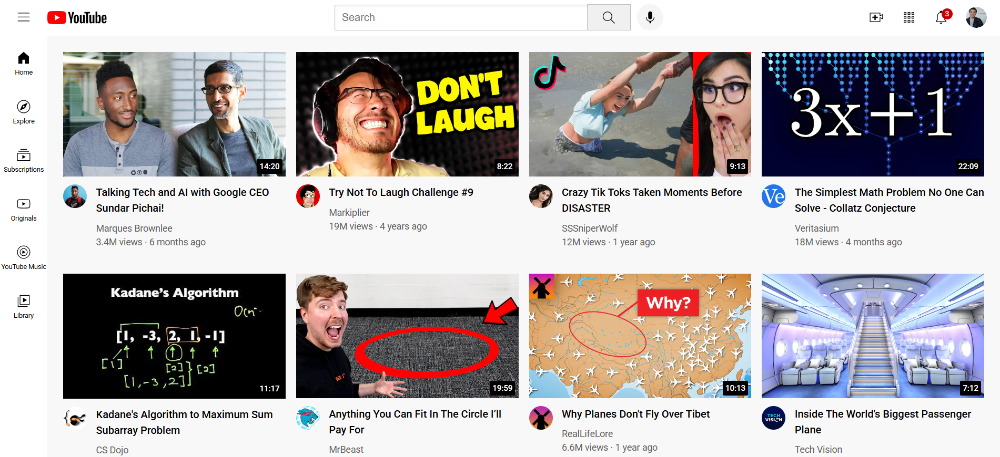

# 🎬 YouTube Website Clone

A simple **YouTube UI clone** built using **HTML** and **CSS** for learning and practice purposes.

This project focuses on mastering layout techniques like **Flexbox**, **Grid**, and responsive design.

---

## 🚀 Tech Stack


---

## 🎯 Project Purpose

This project was created to:

- Practice **HTML structure**

- Learn **CSS layout systems (Flexbox & Grid)**

- Understand how real websites like YouTube are designed

- Improve UI building skills

---

## ✨ Features

- 📺 YouTube-like homepage layout  

- 🧱 Grid-based video section  

- 📌 Sidebar navigation  

- 🔍 Header with search bar  

- 🖼️ Thumbnails and channel images  

- 📱 Basic responsive behavior  

---

## 🖼️ Preview

<p align="center">
  <a href="./preview.png">
  
  </a>  
</p>


---

## 📁 Project Structure

```text
Youtube-website/

│

├── channel-pictures/   # Channel profile images

├── icons/              # UI icons

├── thumbnails/         # Video thumbnails

├── styles/             # CSS files

│

├── index.html          # Main page

├── flexbox.html        # Flexbox practice

├── grid.html           # Grid practice

├── position.html       # Positioning practice

⚙️ How to Run

1️⃣ Clone the repository:

git clone https://github.com/MY-USERNAME/Youtube-website.git

2️⃣ Open the folder:

cd Youtube-website

3️⃣ Run the project:

👉 Open index.html in your browser

🧠 Learning Highlights

This project helped me understand:

CSS Flexbox layout

CSS Grid system

Positioning (absolute, relative)

Structuring large UI pages

Organizing assets (images, icons)

🚧 Future Improvements

Add real video playback

Improve responsiveness (mobile support)

Add JavaScript interactivity

Connect to real APIs

🤝 Contributing

If you like this project:

⭐ Star the repository

🍴 Fork it

📥 Suggest improvements

📄 License

This project is for educational purposes only.

👤 Author

Krif
